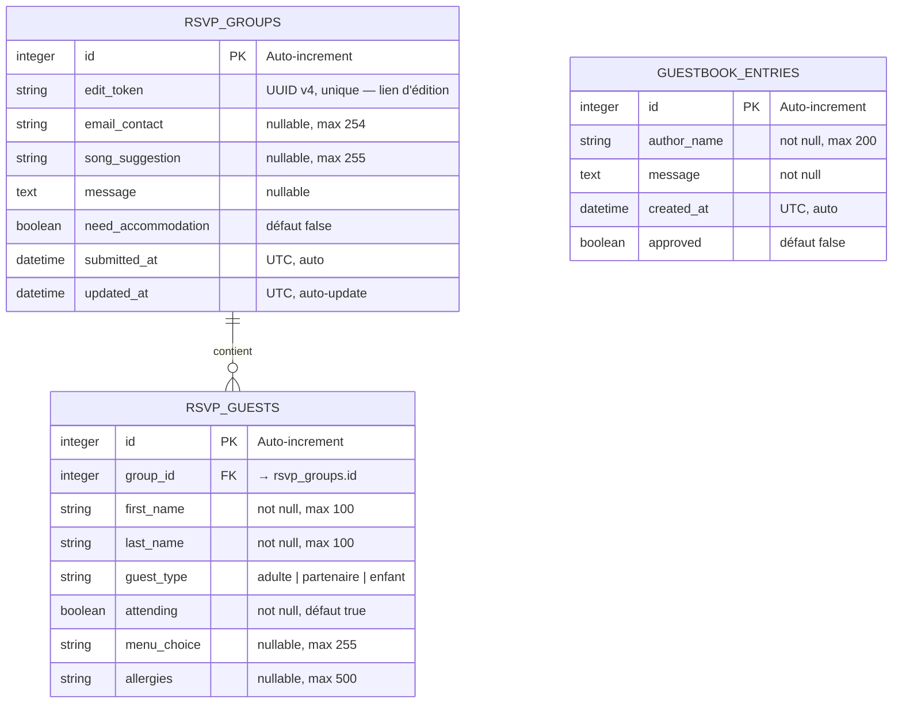
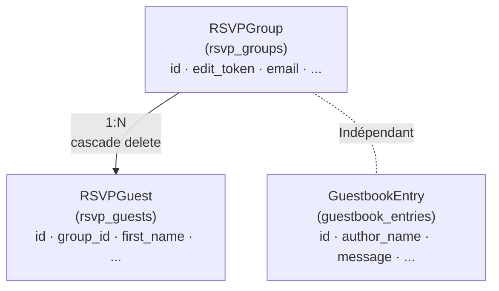
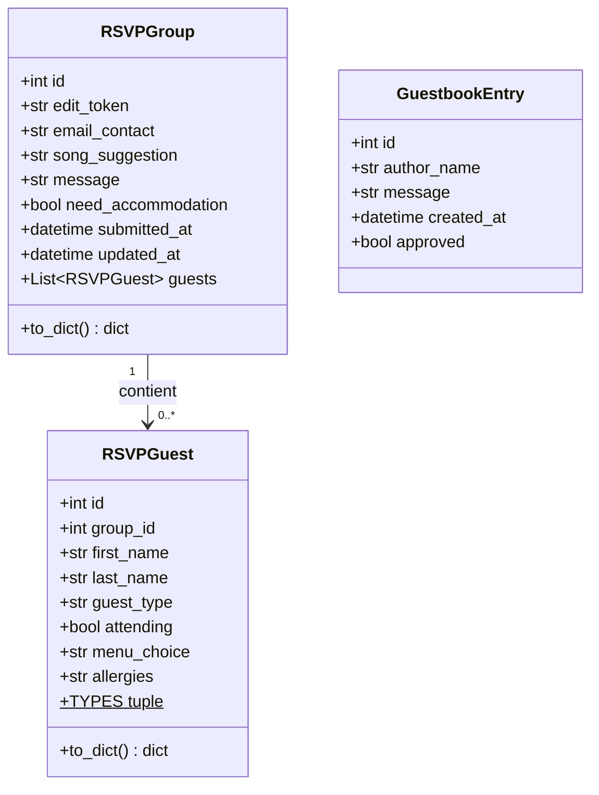
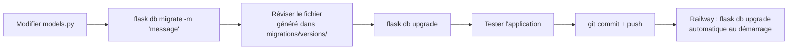

# Documentation base de données — Site de mariage Joyce & Franck

> **Version** : 1.0 — Juillet 2026  
> ORM : SQLAlchemy 2.x · Migrations : Alembic (Flask-Migrate)

---

## Table des matières

1. [Diagramme entité-relation (ER)](#1-diagramme-entité-relation-er)
2. [Tables](#2-tables)
   - [rsvp_groups](#21-rsvp_groups)
   - [rsvp_guests](#22-rsvp_guests)
   - [guestbook_entries](#23-guestbook_entries)
3. [Relations](#3-relations)
4. [Diagramme de classes ORM](#4-diagramme-de-classes-orm)
5. [Schéma SQL (SQLite / PostgreSQL)](#5-schéma-sql-sqlite--postgresql)
6. [Requêtes courantes](#6-requêtes-courantes)
7. [Gestion des migrations](#7-gestion-des-migrations)

---

## 1. Diagramme entité-relation (ER)



---

## 2. Tables

### 2.1 `rsvp_groups`

Représente un **foyer ou groupe familial** qui répond à l'invitation. Une famille répond une seule fois (un groupe = une soumission de formulaire).

| Colonne | Type | Contraintes | Description |
|---|---|---|---|
| `id` | INTEGER | PK, AUTO | Identifiant unique |
| `edit_token` | VARCHAR(36) | UNIQUE, NOT NULL | UUID v4 généré à la création — sert de lien de modification sécurisé |
| `email_contact` | VARCHAR(254) | NULL | E-mail optionnel de l'invité principal |
| `song_suggestion` | VARCHAR(255) | NULL | Suggestion de chanson pour la soirée |
| `message` | TEXT | NULL | Message optionnel aux mariés |
| `need_accommodation` | BOOLEAN | NOT NULL, DEFAULT false | L'invité souhaite des infos hébergement |
| `submitted_at` | TIMESTAMPTZ | NOT NULL | Date/heure d'envoi (UTC) |
| `updated_at` | TIMESTAMPTZ | NOT NULL | Date/heure de dernière modification (UTC) |

**Index implicites** : `id` (PK), `edit_token` (UNIQUE)

---

### 2.2 `rsvp_guests`

Représente **une personne individuelle** au sein d'un groupe RSVP. Un groupe contient au minimum 1 invité (l'invité principal) et peut en contenir davantage (partenaire + enfants).

| Colonne | Type | Contraintes | Description |
|---|---|---|---|
| `id` | INTEGER | PK, AUTO | Identifiant unique |
| `group_id` | INTEGER | FK → `rsvp_groups.id`, NOT NULL | Groupe d'appartenance |
| `first_name` | VARCHAR(100) | NOT NULL | Prénom |
| `last_name` | VARCHAR(100) | NOT NULL | Nom |
| `guest_type` | VARCHAR(20) | NOT NULL | `adulte` \| `partenaire` \| `enfant` |
| `attending` | BOOLEAN | NOT NULL, DEFAULT true | Présent au mariage |
| `menu_choice` | VARCHAR(255) | NULL | Choix de menu sélectionné |
| `allergies` | VARCHAR(500) | NULL | Allergies ou régime alimentaire |

**Valeurs autorisées pour `guest_type`** (contrôle applicatif) :

```python
RSVPGuest.TYPES = ("adulte", "partenaire", "enfant")
```

**Cascade** : `ON DELETE CASCADE` — la suppression d'un `RSVPGroup` supprime automatiquement tous ses `RSVPGuest` associés.

**Index implicites** : `id` (PK), `group_id` (FK)

---

### 2.3 `guestbook_entries`

Table du **livre d'or numérique**, activée après le mariage via la variable `GUESTBOOK_ENABLED=true`. Les messages sont soumis à modération avant publication.

| Colonne | Type | Contraintes | Description |
|---|---|---|---|
| `id` | INTEGER | PK, AUTO | Identifiant unique |
| `author_name` | VARCHAR(200) | NOT NULL | Nom affiché de l'auteur |
| `message` | TEXT | NOT NULL | Contenu du message |
| `created_at` | TIMESTAMPTZ | NOT NULL | Date de soumission (UTC) |
| `approved` | BOOLEAN | NOT NULL, DEFAULT false | Approuvé par l'admin → visible sur le site |

**Workflow modération** :
1. Invité soumet → `approved = false`
2. Admin ouvre `/admin/dashboard` → voit les messages en attente
3. Admin clique « Approuver » → `approved = true` → visible sur le site

---

## 3. Relations



- **RSVPGroup → RSVPGuest** : relation un-à-plusieurs. Lors d'une modification RSVP, **tous les invités du groupe sont supprimés puis recréés** (stratégie replace-all) pour simplifier la logique de mise à jour.
- **GuestbookEntry** : entité indépendante, sans relation avec RSVP.

---

## 4. Diagramme de classes ORM



---

## 5. Schéma SQL (SQLite / PostgreSQL)

> Généré automatiquement par Flask-Migrate. Voici le DDL équivalent pour référence.

```sql
-- Table des groupes RSVP
CREATE TABLE rsvp_groups (
    id                 INTEGER       PRIMARY KEY AUTOINCREMENT,
    edit_token         VARCHAR(36)   NOT NULL UNIQUE,
    email_contact      VARCHAR(254),
    song_suggestion    VARCHAR(255),
    message            TEXT,
    need_accommodation BOOLEAN       NOT NULL DEFAULT FALSE,
    submitted_at       TIMESTAMP     NOT NULL,
    updated_at         TIMESTAMP     NOT NULL
);

-- Table des invités individuels
CREATE TABLE rsvp_guests (
    id           INTEGER      PRIMARY KEY AUTOINCREMENT,
    group_id     INTEGER      NOT NULL REFERENCES rsvp_groups(id) ON DELETE CASCADE,
    first_name   VARCHAR(100) NOT NULL,
    last_name    VARCHAR(100) NOT NULL,
    guest_type   VARCHAR(20)  NOT NULL DEFAULT 'adulte',
    attending    BOOLEAN      NOT NULL DEFAULT TRUE,
    menu_choice  VARCHAR(255),
    allergies    VARCHAR(500)
);

-- Livre d'or
CREATE TABLE guestbook_entries (
    id           INTEGER      PRIMARY KEY AUTOINCREMENT,
    author_name  VARCHAR(200) NOT NULL,
    message      TEXT         NOT NULL,
    created_at   TIMESTAMP    NOT NULL,
    approved     BOOLEAN      NOT NULL DEFAULT FALSE
);

-- Index pour les performances
CREATE INDEX ix_rsvp_guests_group_id ON rsvp_guests(group_id);
```

---

## 6. Requêtes courantes

### 6.1 Statistiques globales

```sql
-- Nombre de groupes ayant répondu
SELECT COUNT(*) AS total_groups FROM rsvp_groups;

-- Personnes présentes / absentes
SELECT
    SUM(CASE WHEN attending = TRUE  THEN 1 ELSE 0 END) AS attending,
    SUM(CASE WHEN attending = FALSE THEN 1 ELSE 0 END) AS declined
FROM rsvp_guests;

-- Répartition par type d'invité
SELECT guest_type, COUNT(*) AS total
FROM rsvp_guests
GROUP BY guest_type;
```

### 6.2 Liste complète pour le traiteur

```sql
-- Toutes les personnes présentes avec leur menu
SELECT
    g.submitted_at,
    g.email_contact,
    gu.first_name,
    gu.last_name,
    gu.guest_type,
    gu.menu_choice,
    gu.allergies
FROM rsvp_groups g
JOIN rsvp_guests gu ON gu.group_id = g.id
WHERE gu.attending = TRUE
ORDER BY g.submitted_at, gu.guest_type;
```

### 6.3 Besoins d'hébergement

```sql
SELECT
    g.email_contact,
    COUNT(gu.id) AS nb_personnes
FROM rsvp_groups g
JOIN rsvp_guests gu ON gu.group_id = g.id
WHERE g.need_accommodation = TRUE
  AND gu.attending = TRUE
GROUP BY g.id, g.email_contact;
```

### 6.4 Suggestions de chansons

```sql
SELECT song_suggestion, submitted_at
FROM rsvp_groups
WHERE song_suggestion IS NOT NULL
ORDER BY submitted_at;
```

### 6.5 Récupérer un groupe par token (édition)

```sql
SELECT * FROM rsvp_groups WHERE edit_token = '550e8400-e29b-41d4-a716-446655440000';
```

---

## 7. Gestion des migrations

### Commandes essentielles

```bash
# Initialisation (une seule fois, dossier migrations/ déjà créé)
flask db init

# Générer une migration après modification des modèles
flask db migrate -m "description du changement"

# Appliquer les migrations en attente
flask db upgrade

# Annuler la dernière migration
flask db downgrade

# Voir l'état actuel
flask db current

# Historique des migrations
flask db history
```

### Workflow de modification de modèle



### Migration initiale (référence)

Fichier : `migrations/versions/483d712fd35b_initial.py`

Crée les 3 tables : `rsvp_groups`, `rsvp_guests`, `guestbook_entries`.

### Ajout d'une colonne (exemple)

```python
# Dans models.py, ajouter à RSVPGroup :
dietary_preference = db.Column(db.String(100), nullable=True)

# Puis :
# flask db migrate -m "add dietary_preference to rsvp_guests"
# flask db upgrade
```

---

## Notes de maintenance

- **Backup** : exporter le CSV admin régulièrement avant le mariage (`/admin/export.csv`)
- **Nettoyage** : après le mariage, les tokens d'édition peuvent être révoqués en vidant la table ou en ajoutant une colonne `expires_at`
- **Livre d'or** : activer `GUESTBOOK_ENABLED=true` après le 19/09/2026, puis modérer depuis `/admin/dashboard`
