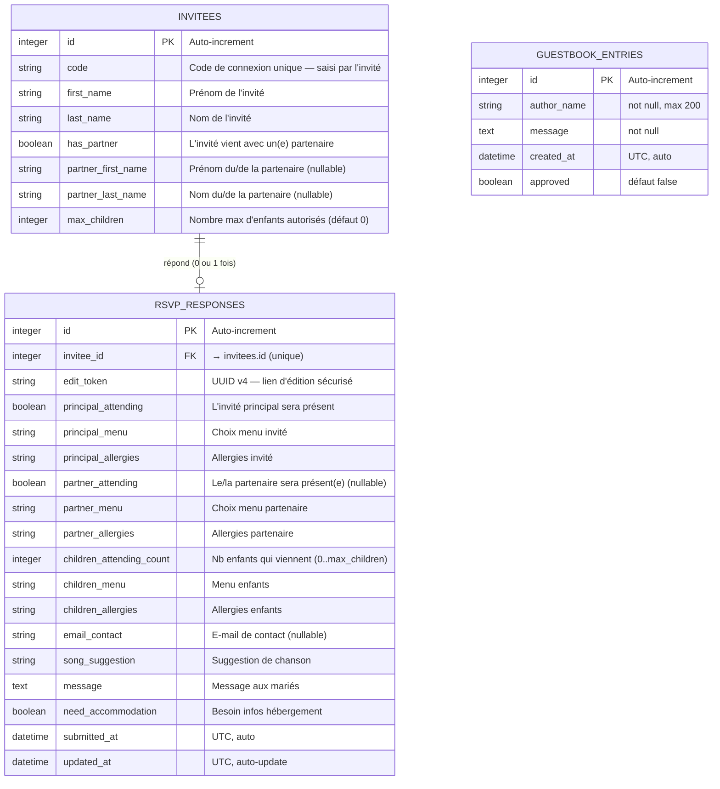
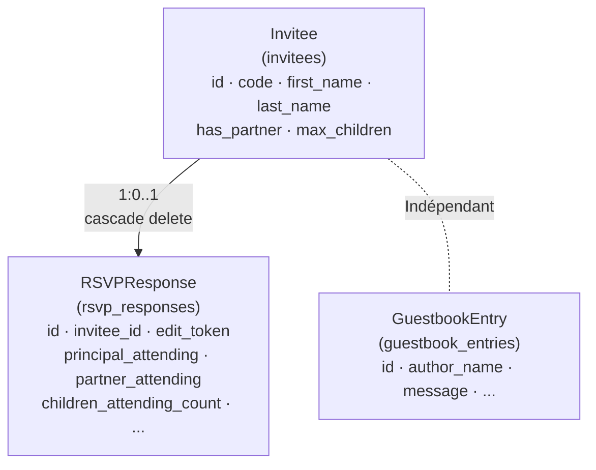
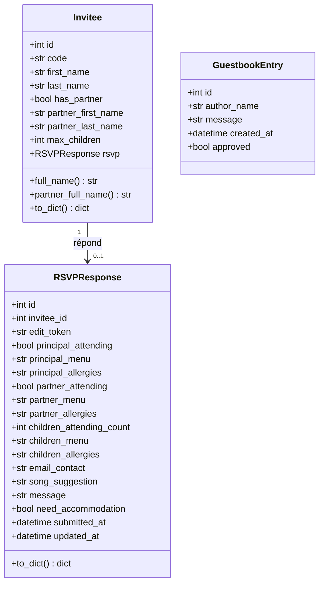
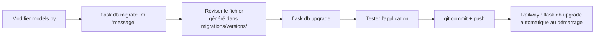

# Documentation base de données — Site de mariage Joyce & Franck

> **Version** : 2.0 — Juillet 2026  
> ORM : SQLAlchemy 2.x · Migrations : Alembic (Flask-Migrate)

---

## Table des matières

1. [Diagramme entité-relation (ER)](#1-diagramme-entité-relation-er)
2. [Tables](#2-tables)
   - [invitees](#21-invitees)
   - [rsvp_responses](#22-rsvp_responses)
   - [guestbook_entries](#23-guestbook_entries)
3. [Relations](#3-relations)
4. [Diagramme de classes ORM](#4-diagramme-de-classes-orm)
5. [Schéma SQL (SQLite / PostgreSQL)](#5-schéma-sql-sqlite--postgresql)
6. [Requêtes courantes](#6-requêtes-courantes)
7. [Gestion des migrations](#7-gestion-des-migrations)

---

## 1. Diagramme entité-relation (ER)



---

## 2. Tables

### 2.1 `invitees`

Représente un **invité pré-enregistré** par les mariés avant l'ouverture du site. Chaque invité possède un code de connexion unique. Les informations sur le partenaire et le nombre d'enfants sont définies par les mariés au moment de l'enregistrement.

| Colonne | Type | Contraintes | Description |
|---|---|---|---|
| `id` | INTEGER | PK, AUTO | Identifiant unique |
| `code` | VARCHAR(50) | UNIQUE, NOT NULL | Code de connexion personnel |
| `first_name` | VARCHAR(100) | NOT NULL | Prénom de l'invité principal |
| `last_name` | VARCHAR(100) | NOT NULL | Nom de l'invité principal |
| `has_partner` | BOOLEAN | NOT NULL, DEFAULT false | L'invité peut indiquer la présence de son/sa partenaire |
| `partner_first_name` | VARCHAR(100) | NULL | Prénom du/de la partenaire |
| `partner_last_name` | VARCHAR(100) | NULL | Nom du/de la partenaire |
| `max_children` | INTEGER | NOT NULL, DEFAULT 0 | Nombre max d'enfants que l'invité peut amener |

**Index** : `id` (PK), `code` (UNIQUE)

**Propriétés calculées (Python)** : `full_name`, `partner_full_name`

---

### 2.2 `rsvp_responses`

Représente la **réponse RSVP unique** d'un invité. Relation 1:1 avec `invitees`. La réponse est créée lors de la première soumission ; les modifications ultérieures mettent à jour le même enregistrement. Les noms des enfants ne sont **pas** enregistrés — seul le nombre est conservé.

| Colonne | Type | Contraintes | Description |
|---|---|---|---|
| `id` | INTEGER | PK, AUTO | Identifiant unique |
| `invitee_id` | INTEGER | FK → `invitees.id`, UNIQUE, NOT NULL | Invité propriétaire |
| `edit_token` | VARCHAR(36) | UNIQUE, NOT NULL | UUID v4 — lien d'édition sécurisé |
| `principal_attending` | BOOLEAN | NOT NULL | L'invité principal sera présent |
| `principal_menu` | VARCHAR(255) | NULL | Menu de l'invité principal |
| `principal_allergies` | VARCHAR(500) | NULL | Allergies de l'invité principal |
| `partner_attending` | BOOLEAN | NULL | Le/la partenaire sera présent(e) (`null` si pas de partenaire) |
| `partner_menu` | VARCHAR(255) | NULL | Menu du/de la partenaire |
| `partner_allergies` | VARCHAR(500) | NULL | Allergies du/de la partenaire |
| `children_attending_count` | INTEGER | NOT NULL, DEFAULT 0 | Nombre d'enfants présents (0 à `max_children`) |
| `children_menu` | VARCHAR(255) | NULL | Menu pour les enfants |
| `children_allergies` | VARCHAR(500) | NULL | Allergies des enfants |
| `email_contact` | VARCHAR(254) | NULL | E-mail de contact |
| `song_suggestion` | VARCHAR(255) | NULL | Suggestion de chanson |
| `message` | TEXT | NULL | Message aux mariés |
| `need_accommodation` | BOOLEAN | NOT NULL, DEFAULT false | Besoin infos hébergement |
| `submitted_at` | TIMESTAMPTZ | NOT NULL | Date/heure de la première soumission (UTC) |
| `updated_at` | TIMESTAMPTZ | NOT NULL | Date/heure de la dernière modification (UTC) |

**Index** : `id` (PK), `invitee_id` (UNIQUE FK), `edit_token` (UNIQUE)

**Contrainte** : `children_attending_count` ≤ `invitees.max_children` (vérification applicative)

---

### 2.3 `guestbook_entries`

Table du **livre d'or numérique**, activée après le mariage via la variable `GUESTBOOK_ENABLED=true`. Les messages sont soumis à modération avant publication.

| Colonne | Type | Contraintes | Description |
|---|---|---|---|
| `id` | INTEGER | PK, AUTO | Identifiant unique |
| `author_name` | VARCHAR(200) | NOT NULL | Nom affiché de l'auteur |
| `message` | TEXT | NOT NULL | Contenu du message |
| `created_at` | TIMESTAMPTZ | NOT NULL | Date de soumission (UTC) |
| `approved` | BOOLEAN | NOT NULL, DEFAULT false | Approuvé par l'admin → visible sur le site |

**Workflow modération** :
1. Invité soumet → `approved = false`
2. Admin ouvre `/admin/dashboard` → voit les messages en attente
3. Admin clique « Approuver » → `approved = true` → visible sur le site

---

## 3. Relations



- **Invitee → RSVPResponse** : relation un-à-zéro-ou-un. Chaque invité peut avoir au maximum une réponse RSVP. La suppression d'un `Invitee` supprime automatiquement sa `RSVPResponse` (cascade).
- **GuestbookEntry** : entité indépendante, sans relation avec les invités.

---

## 4. Diagramme de classes ORM



---

## 5. Schéma SQL (SQLite / PostgreSQL)

> Généré automatiquement par Flask-Migrate. Voici le DDL équivalent pour référence.

```sql
-- Table des invités pré-enregistrés
CREATE TABLE invitees (
    id                  INTEGER       PRIMARY KEY AUTOINCREMENT,
    code                VARCHAR(50)   NOT NULL UNIQUE,
    first_name          VARCHAR(100)  NOT NULL,
    last_name           VARCHAR(100)  NOT NULL,
    has_partner         BOOLEAN       NOT NULL DEFAULT FALSE,
    partner_first_name  VARCHAR(100),
    partner_last_name   VARCHAR(100),
    max_children        INTEGER       NOT NULL DEFAULT 0
);

-- Table des réponses RSVP (1:1 avec invitees)
CREATE TABLE rsvp_responses (
    id                       INTEGER       PRIMARY KEY AUTOINCREMENT,
    invitee_id               INTEGER       NOT NULL UNIQUE REFERENCES invitees(id) ON DELETE CASCADE,
    edit_token               VARCHAR(36)   NOT NULL UNIQUE,
    principal_attending      BOOLEAN       NOT NULL,
    principal_menu           VARCHAR(255),
    principal_allergies      VARCHAR(500),
    partner_attending        BOOLEAN,
    partner_menu             VARCHAR(255),
    partner_allergies        VARCHAR(500),
    children_attending_count INTEGER       NOT NULL DEFAULT 0,
    children_menu            VARCHAR(255),
    children_allergies       VARCHAR(500),
    email_contact            VARCHAR(254),
    song_suggestion          VARCHAR(255),
    message                  TEXT,
    need_accommodation       BOOLEAN       NOT NULL DEFAULT FALSE,
    submitted_at             TIMESTAMP     NOT NULL,
    updated_at               TIMESTAMP     NOT NULL
);

-- Livre d'or
CREATE TABLE guestbook_entries (
    id           INTEGER      PRIMARY KEY AUTOINCREMENT,
    author_name  VARCHAR(200) NOT NULL,
    message      TEXT         NOT NULL,
    created_at   TIMESTAMP    NOT NULL,
    approved     BOOLEAN      NOT NULL DEFAULT FALSE
);

-- Index
CREATE UNIQUE INDEX uq_invitees_code   ON invitees(code);
CREATE UNIQUE INDEX uq_rsvp_invitee_id ON rsvp_responses(invitee_id);
CREATE UNIQUE INDEX uq_rsvp_edit_token ON rsvp_responses(edit_token);
```

---

## 6. Requêtes courantes

### 6.1 Statistiques globales

```sql
-- Invités enregistrés
SELECT COUNT(*) AS total_invited FROM invitees;

-- Réponses RSVP reçues
SELECT COUNT(*) AS rsvps_submitted FROM rsvp_responses;

-- Personnes présentes (invités principaux + partenaires + enfants)
SELECT
    SUM(CASE WHEN principal_attending = TRUE THEN 1 ELSE 0 END)
  + SUM(CASE WHEN partner_attending  = TRUE THEN 1 ELSE 0 END)
  + SUM(children_attending_count)
AS total_attending
FROM rsvp_responses;
```

### 6.2 Liste complète pour le traiteur

```sql
-- Invités principaux présents
SELECT i.first_name, i.last_name,
       r.principal_menu AS menu, r.principal_allergies AS allergies,
       'invité principal' AS role
FROM invitees i
JOIN rsvp_responses r ON r.invitee_id = i.id
WHERE r.principal_attending = TRUE

UNION ALL

-- Partenaires présents
SELECT i.partner_first_name, i.partner_last_name,
       r.partner_menu, r.partner_allergies, 'partenaire'
FROM invitees i
JOIN rsvp_responses r ON r.invitee_id = i.id
WHERE i.has_partner = TRUE AND r.partner_attending = TRUE

ORDER BY last_name, first_name;
```

### 6.3 Besoins d'hébergement

```sql
SELECT i.first_name, i.last_name, r.email_contact, r.children_attending_count
FROM invitees i
JOIN rsvp_responses r ON r.invitee_id = i.id
WHERE r.need_accommodation = TRUE
ORDER BY i.last_name;
```

### 6.4 Suggestions de chansons

```sql
SELECT i.first_name, i.last_name, r.song_suggestion, r.submitted_at
FROM invitees i
JOIN rsvp_responses r ON r.invitee_id = i.id
WHERE r.song_suggestion IS NOT NULL
ORDER BY r.submitted_at;
```

### 6.5 Invités en attente de réponse

```sql
SELECT i.first_name, i.last_name, i.code
FROM invitees i
LEFT JOIN rsvp_responses r ON r.invitee_id = i.id
WHERE r.id IS NULL
ORDER BY i.last_name;
```

### 6.6 Récupérer une réponse par token (édition)

```sql
SELECT * FROM rsvp_responses WHERE edit_token = '550e8400-e29b-41d4-a716-446655440000';
```

---

## 7. Gestion des migrations

### Commandes essentielles

```bash
# Initialisation (une seule fois, dossier migrations/ déjà créé)
flask db init

# Générer une migration après modification des modèles
flask db migrate -m "description du changement"

# Appliquer les migrations en attente
flask db upgrade

# Annuler la dernière migration
flask db downgrade

# Voir l'état actuel
flask db current

# Historique des migrations
flask db history
```

### Workflow de modification de modèle



### Historique des migrations

| Révision | Message | Description |
|---|---|---|
| `483d712fd35b` | `initial` | Crée `rsvp_groups`, `rsvp_guests`, `guestbook_entries` |
| `6a1b6a26d1e9` | `invitees_and_rsvp_responses` | Supprime les anciennes tables, crée `invitees` et `rsvp_responses` |

### Ajout d'une colonne (exemple)

```python
# Dans models.py, ajouter à Invitee :
dietary_preference = db.Column(db.String(100), nullable=True)

# Puis :
# flask db migrate -m "add dietary_preference to invitees"
# flask db upgrade
```

---

## Notes de maintenance

- **Backup** : exporter le CSV admin régulièrement avant le mariage (`/admin/export.csv`)
- **Nettoyage** : après le mariage, les tokens d'édition peuvent être révoqués en vidant la table ou en ajoutant une colonne `expires_at`
- **Livre d'or** : activer `GUESTBOOK_ENABLED=true` après le 19/09/2026, puis modérer depuis `/admin/dashboard`
