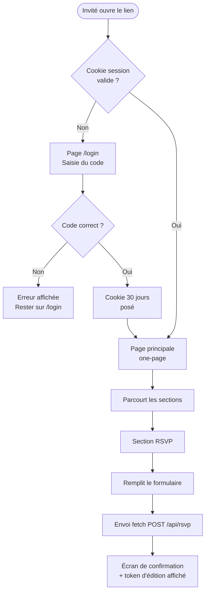
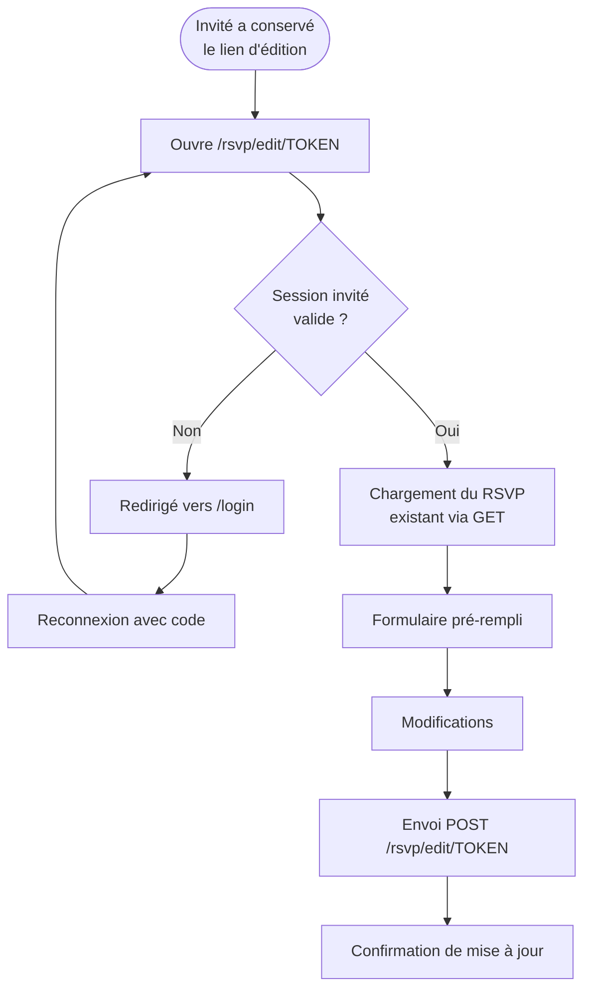
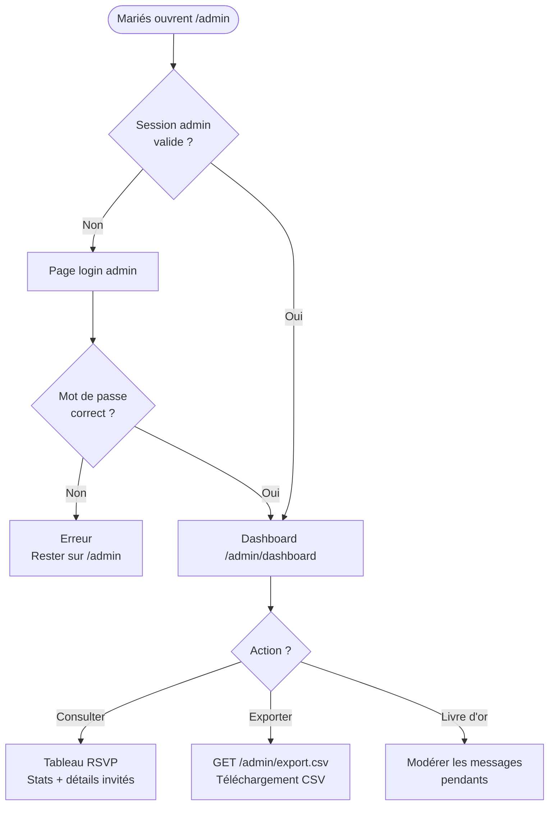

# Documentation fonctionnelle — Site de mariage Joyce & Franck

> **Mariage** : Joyce Maïssa & Franck Quentin — 19 septembre 2026, Meaux (France)  
> **Version** : 1.0 — Juillet 2026

---

## Table des matières

1. [Objectif du site](#1-objectif-du-site)
2. [Accès et authentification](#2-accès-et-authentification)
3. [Structure de la page](#3-structure-de-la-page)
4. [Parcours utilisateurs](#4-parcours-utilisateurs)
5. [Formulaire RSVP — logique détaillée](#5-formulaire-rsvp--logique-détaillée)
6. [Tableau de bord admin](#6-tableau-de-bord-admin)
7. [Fonctionnalités différées](#7-fonctionnalités-différées)
8. [Checklist des contenus à personnaliser](#8-checklist-des-contenus-à-personnaliser)

---

## 1. Objectif du site

Le site est un **espace privé one-page** destiné exclusivement aux invités du mariage. Il remplit quatre rôles :

| Rôle | Description |
|---|---|
| **Informer** | Programme de la journée, lieux, accès, dress code, FAQ |
| **Confirmer** | Formulaire RSVP avec présence + choix de menu pour chaque personne du foyer |
| **Partager** | Galerie photos, histoire des mariés, suggestion de chansons |
| **Administrer** | Tableau de bord pour les mariés : consulter les réponses, exporter le CSV pour le traiteur |

---

## 2. Accès et authentification

### 2.1 Accès invités — page de code

```
┌─────────────────────────────────────────┐
│         Joyce & Franck                  │
│         19 · 09 · 2026                  │
│                                         │
│   Entrez votre code d'invitation        │
│   ┌─────────────────────────────────┐   │
│   │  ••••••••••                     │   │
│   └─────────────────────────────────┘   │
│        [ Accéder au site ]              │
└─────────────────────────────────────────┘
```

- **Un seul code** partagé pour tous les invités (simple, pas de comptes individuels).
- Le code est défini par la variable d'environnement `SITE_PASSWORD`.
- Après validation : cookie de session **valable 30 jours** — l'invité n'a pas à ressaisir le code à chaque visite.
- Si le code est incorrect : message d'erreur affiché sur place, sans redirection.

### 2.2 Accès admin

- URL : `/admin`
- Mot de passe distinct défini par `ADMIN_PASSWORD`.
- Session admin distincte de la session invité (clé `admin_access` vs `site_access`).
- Accessible uniquement par les mariés.

---

## 3. Structure de la page

La page principale est un **one-page** avec navigation ancrée. Les sections s'enchaînent dans l'ordre suivant :

```
┌──────────────────── NAV STICKY ─────────────────────────┐
│  J & F   Histoire  Programme  Lieux  Galerie             │
│          Dresscode  Cadeau  FAQ  [ RSVP ]                │
└──────────────────────────────────────────────────────────┘

  ▼ HERO           ← Section #hero
  ▼ NOTRE HISTOIRE ← Section #histoire
  ▼ PROGRAMME      ← Section #programme
  ▼ LIEUX & ACCÈS  ← Section #lieux
  ▼ GALERIE        ← Section #galerie
  ▼ DRESS CODE     ← Section #dresscode
  ▼ CAGNOTTE       ← Section #cagnotte
  ▼ FAQ            ← Section #faq
  ▼ RSVP           ← Section #rsvp
  ▼ FOOTER
```

### 3.1 Navigation

- **Sticky** (fixée en haut, suit le scroll)
- **Highlight automatique** : la section visible à l'écran est mise en surbrillance dans la nav via `IntersectionObserver`
- **Menu hamburger** sur mobile (< 640 px) : slide-down depuis le haut
- **RSVP** : lien mis en avant avec style bouton doré

### 3.2 Section HERO

| Élément | Détail |
|---|---|
| Prénoms | Joyce Maïssa & Franck Quentin (typographie serif grand format) |
| Date | 19 · 09 · 2026 |
| Lieu | Meaux, France |
| Compte à rebours | Live, recalculé toutes les secondes, jusqu'au 19/09/2026 à 13h30 |
| Fond | Dégradé pastel + illustrations florales SVG (à remplacer par une vraie photo) |
| CTA | Bouton « Confirmer ma présence » → ancre `#rsvp` |

### 3.3 Section Programme

Timeline verticale avec 4 étapes :

| Heure | Événement | Lieu |
|---|---|---|
| 13h30 | Mariage civil | Mairie de Meaux |
| 15h00 | Cérémonie religieuse | Église Notre-Dame-du-Marché |
| 17h30 | Vin d'honneur | Jardins du Manoir |
| 20h00 | Soirée ★ | Manoir de Tigeaux |

### 3.4 Section Lieux & Accès

3 cartes de lieux avec lien Google Maps + bloc hébergements (placeholders à compléter).

### 3.5 Section Galerie

- Grille masonry responsive (3 colonnes desktop / 2 tablette / 1 mobile)
- 9 photos placeholder (Picsum) à remplacer par de vraies photos
- **Lightbox** au clic : navigation avec flèches, clavier (←/→/Échap), fermeture en cliquant en dehors

### 3.6 Section Dress Code

- Description textuelle
- **Palette de couleurs visuelle** : 6 nuanciers cliquables (rose poudré, vert sauge, bleu ciel, miel, beige, or)
- Mention explicite encadrée : **« Le blanc est réservé à la mariée »**

### 3.7 Section Cagnotte

- Message d'intention (voyage de noces)
- Bouton vers le lien de la cagnotte *(à renseigner)*

### 3.8 FAQ

5 questions pré-remplies, accordion (une seule ouverte à la fois) :

1. Y a-t-il un parking au Manoir de Tigeaux ?
2. Les enfants sont-ils les bienvenus ?
3. À quelle heure se termine la soirée ?
4. Peut-on prendre des photos pendant la cérémonie ?
5. Comment se rendre au Manoir depuis Meaux ?

### 3.9 Footer

> Joyce & Franck · 19 · 09 · 2026 — Meaux, France  
> *Avec amour, Joyce & Franck 💛*

Lien de déconnexion discret en bas de page.

---

## 4. Parcours utilisateurs

### 4.1 Invité — première visite



### 4.2 Invité — modification de sa réponse



### 4.3 Mariés — consultation des réponses



---

## 5. Formulaire RSVP — logique détaillée

### 5.1 Structure du formulaire

```
┌─────────────────────────── FORMULAIRE RSVP ───────────────────────────┐
│                                                                        │
│  ┌── VOUS (invité principal) ─────────────────────────────────────┐   │
│  │  Prénom* · Nom* · Présence* · Menu · Allergies                 │   │
│  └────────────────────────────────────────────────────────────────┘   │
│                                                                        │
│  [ + Ajouter mon/ma partenaire ]                                      │
│                                                                        │
│  ┌── PARTENAIRE (optionnel, max 1) ───────────────────────────────┐   │
│  │  Prénom* · Nom* · Présence* · Menu · Allergies          [✕]   │   │
│  └────────────────────────────────────────────────────────────────┘   │
│                                                                        │
│  ┌── ENFANT 1 (optionnel, illimité) ──────────────────────────────┐   │
│  │  Prénom* · Nom* · Présence* · Menu enfant · Allergies  [✕]   │   │
│  └────────────────────────────────────────────────────────────────┘   │
│                                                                        │
│  [ + Ajouter un enfant ]                                              │
│                                                                        │
│  ─────────── Informations du groupe ─────────────────────────────     │
│  E-mail de contact (optionnel)                                        │
│  Suggérez une chanson 🎵 (optionnel)                                  │
│  Message aux mariés (optionnel)                                       │
│  ☐ Besoin d'infos hébergement                                        │
│                                                                        │
│                    [ Envoyer ma réponse ]                             │
└────────────────────────────────────────────────────────────────────────┘
```

### 5.2 Règles de validation

| Champ | Règle |
|---|---|
| Prénom / Nom | Requis pour chaque personne, non vide après trim |
| Présence | Requis (radio Oui/Non), défaut Oui |
| Menu / Allergies | Masqués si Présence = Non |
| E-mail | Format email valide (HTML5 natif), optionnel |
| Message | Max 1 000 caractères |
| Allergies | Max 300 caractères |
| Chanson | Max 255 caractères |
| Type invité | Contrôlé côté serveur : `adulte` / `partenaire` / `enfant` |

### 5.3 Comportement après envoi

1. **Écran de confirmation** s'affiche (formulaire masqué)
2. **Token d'édition** (UUID) affiché sous forme de lien complet : `https://…/rsvp/edit/<uuid>`
3. Token stocké dans `localStorage` pour le bouton « Modifier ma réponse »
4. L'invité doit **copier/sauvegarder ce lien** — aucun email n'est envoyé

### 5.4 Modification d'une réponse

- Accès via le lien `/rsvp/edit/<token>`
- La session invité doit être valide (cookie 30 j)
- Toutes les données précédentes sont **remplacées** (les anciens invités du groupe sont supprimés et recréés)
- Pas de date limite implémentée côté code (à gérer manuellement si nécessaire)

---

## 6. Tableau de bord admin

URL : `/admin/dashboard` (protégé par `ADMIN_PASSWORD`)

### 6.1 Statistiques affichées

| Indicateur | Calcul |
|---|---|
| Nombre de groupes / foyers | `COUNT(rsvp_groups)` |
| Personnes présentes | `COUNT(rsvp_guests WHERE attending=true)` |
| Personnes absentes | `COUNT(rsvp_guests WHERE attending=false)` |
| Total réponses | Présents + Absents |

### 6.2 Tableau des réponses

Pour chaque groupe : date d'envoi, e-mail, liste des invités (avec type, présence, menu, allergies), indication hébergement, chanson suggérée, message.

### 6.3 Export CSV

Route : `GET /admin/export.csv`

Colonnes exportées :

```
group_id | edit_token | email_contact | need_accommodation | song_suggestion |
message | submitted_at | guest_first_name | guest_last_name | guest_type |
attending | menu_choice | allergies
```

Une ligne par personne (invité principal + partenaire + chaque enfant). Format adapté pour import dans Excel / Google Sheets pour transmission au traiteur.

### 6.4 Modération livre d'or *(si activé)*

- Affiche les messages en attente d'approbation
- Bouton « Approuver » par message
- Les messages non approuvés ne sont pas visibles sur le site

---

## 7. Fonctionnalités différées

### 7.1 Livre d'or

Préparé dans la base de données et le code, désactivé par défaut.

**Pour activer après le mariage :**
```bash
# Dans .env (ou variables Railway)
GUESTBOOK_ENABLED=true
```

La section « Livre d'or » apparaît alors automatiquement sur la page principale. Les invités peuvent laisser un message ; les mariés l'approuvent depuis `/admin/dashboard`.

### 7.2 Fonctionnalités non implémentées (à ajouter si besoin)

| Fonctionnalité | Notes |
|---|---|
| Envoi d'e-mail de confirmation | Ajouter Flask-Mail + SMTP |
| Date limite de modification RSVP | Comparer `submitted_at` à une date pivot |
| Playlist collaborative | Le champ `song_suggestion` existe déjà dans la DB |
| Version bilingue FR/EN | Flask-Babel + fichiers de traduction |
| Notifications admin (nouvelles réponses) | Webhook ou polling |

---

## 8. Checklist des contenus à personnaliser

### Contenus obligatoires avant la mise en ligne

- [ ] **`SITE_PASSWORD`** dans `.env` — code d'invitation final
- [ ] **`ADMIN_PASSWORD`** dans `.env` — mot de passe admin final
- [ ] **Menus adultes et enfants** : remplacer les `<option>` placeholder dans `templates/index.html` (sections `#main-menu`, `#partner-menu`, `#child-{n}-menu`)
- [ ] **Lien cagnotte** : remplacer `href="#"` du bouton `#cagnotte-link` dans `templates/index.html`

### Contenus recommandés

- [ ] **Photos galerie** : remplacer les 9 URLs `https://picsum.photos/seed/wedding{n}/…` dans `templates/index.html`
- [ ] **Photo hero** : remplacer le dégradé CSS de `.hero` par `background-image: url('/static/img/hero.jpg')` dans `static/css/style.css`
- [ ] **Histoire des mariés** : éditer les paragraphes dans la section `#histoire` de `templates/index.html`
- [ ] **Hébergements** : compléter les 4 cartes `.hebergement-item` dans `templates/index.html`
- [ ] **Adresses exactes** : vérifier/compléter les adresses de la mairie et de l'église dans `templates/index.html` (sections `#programme` et `#lieux`)
- [ ] **Favicon** : ajouter `static/favicon.ico` + `<link rel="icon">` dans `templates/base.html`

### Contenus optionnels

- [ ] **FAQ** : ajouter/modifier des questions dans la section `#faq` de `templates/index.html`
- [ ] **Livre d'or** : activer avec `GUESTBOOK_ENABLED=true` après le mariage
- [ ] **Meta OG** : ajouter balises Open Graph dans `templates/base.html` pour l'aperçu lien
