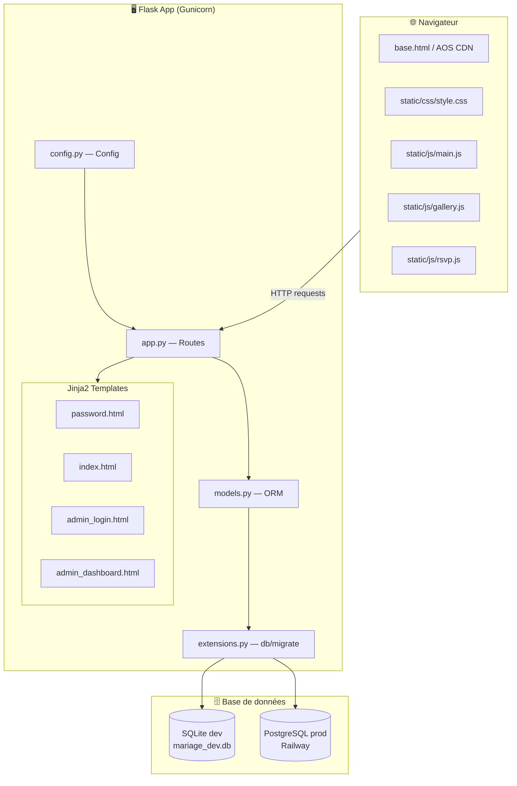
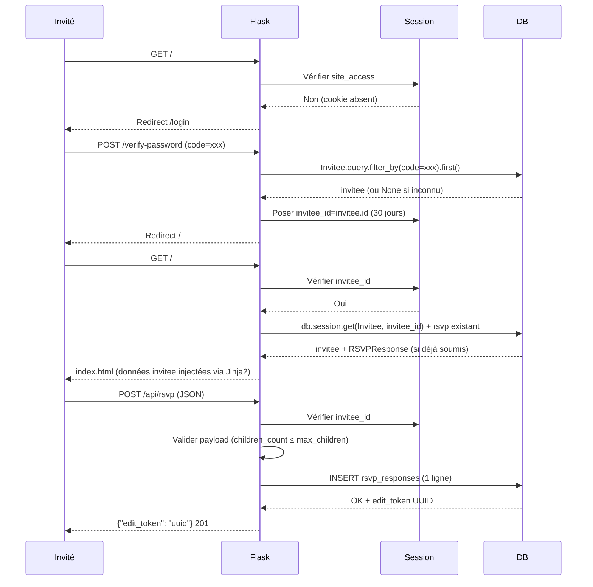
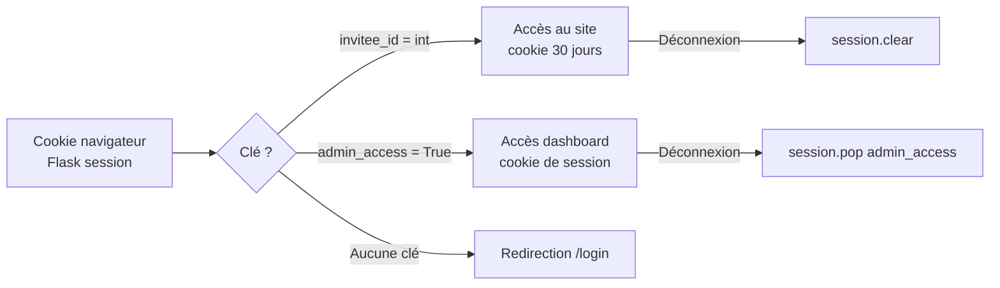
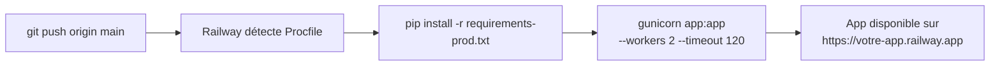

# Documentation technique — Site de mariage Joyce & Franck

> **Version** : 1.0 — Juillet 2026

---

## Table des matières

1. [Stack technologique](#1-stack-technologique)
2. [Architecture applicative](#2-architecture-applicative)
3. [Structure du projet](#3-structure-du-projet)
4. [Couche serveur (Flask)](#4-couche-serveur-flask)
5. [Référence des routes](#5-référence-des-routes)
6. [Couche frontend](#6-couche-frontend)
7. [Sécurité](#7-sécurité)
8. [Configuration & variables d'environnement](#8-configuration--variables-denvironnement)
9. [Base de données — modèles](#9-base-de-données--modèles)
10. [Déploiement Railway](#10-déploiement-railway)
11. [Décisions d'architecture](#11-décisions-darchitecture)

---

## 1. Stack technologique

| Couche | Technologie | Version | Rôle |
|---|---|---|---|
| Backend | **Flask** | 3.0.3 | Framework web Python |
| ORM | **Flask-SQLAlchemy** | 3.1.1 | Abstraction base de données |
| Migrations | **Flask-Migrate** (Alembic) | 4.0.7 | Gestion du schéma DB |
| Templating | **Jinja2** | *(inclus Flask)* | Rendu HTML côté serveur |
| Sécurité | **Werkzeug** | 3.0.3 | Hachage de mots de passe |
| Config | **python-dotenv** | 1.0.1 | Variables d'environnement |
| Serveur prod | **Gunicorn** | 22.0.0 | WSGI server (Railway) |
| DB dev | **SQLite** | *(stdlib)* | Fichier local `mariage_dev.db` |
| DB prod | **PostgreSQL** | 15+ | Via Railway, driver psycopg2 |
| Animations | **AOS** | 2.3.4 | Animate On Scroll (CDN) |
| Fonts | **Google Fonts** | — | Cormorant Garamond + Nunito |
| CSS | Vanilla CSS | — | Variables custom, responsive |
| JS | Vanilla JS | ES2020 | Aucune dépendance frontend |

---

## 2. Architecture applicative

### 2.1 Vue d'ensemble



### 2.2 Flux de requête typique



### 2.3 Architecture des sessions



---

## 3. Structure du projet

```
proj_test/
│
├── app.py              ← Point d'entrée + factory create_app()
│                          _register_routes() pour toutes les routes
│                          Décorateurs d'auth : _require_site_access, _require_admin
│
├── config.py           ← Classes Config, DevelopmentConfig, ProductionConfig
│                          config_by_name dict (sélection par FLASK_ENV)
│
├── extensions.py       ← Instanciation db = SQLAlchemy(), migrate = Migrate()
│                          Évite les imports circulaires
│
├── models.py           ← Invitee, RSVPResponse, GuestbookEntry
│                          Chaque modèle expose .to_dict() pour la sérialisation JSON
│
├── templates/
│   ├── base.html       ← Layout HTML5 : <head>, Google Fonts, AOS CDN, blocks
│   ├── password.html   ← Étend base.html, formulaire d'accès
│   ├── index.html      ← Page principale : 9 sections + footer
│   ├── admin_login.html← Formulaire login admin (POST /admin/login)
│   └── admin_dashboard.html ← Stats, tableau RSVP, export, modération
│
├── static/
│   ├── css/style.css   ← Variables CSS, composants, responsive (3 breakpoints)
│   ├── js/main.js      ← AOS.init, nav scroll/hamburger, IntersectionObserver,
│   │                      countdown, FAQ accordion, smooth scroll
│   ├── js/gallery.js   ← Lightbox : open/close/navigate, keyboard, body-scroll-lock
│   └── js/rsvp.js      ← Partenaire toggle, enfants dynamiques, attending toggle,
│                          collect → fetch POST, confirmation, localStorage token,
│                          livre d'or submit
│
├── migrations/         ← Fichiers Alembic générés par flask db migrate
│   └── versions/
│       ├── 483d712fd35b_initial.py
│       └── 6a1b6a26d1e9_invitees_and_rsvp_responses.py
│
├── .env                ← Variables locales (NON versionné)
├── .env.example        ← Template (versionné)
├── requirements.txt    ← Dépendances dev (sans psycopg2)
├── requirements-prod.txt← Dépendances prod (avec psycopg2)
├── Procfile            ← gunicorn app:app --workers 2 --timeout 120
└── runtime.txt         ← python-3.12.3
```

---

## 4. Couche serveur (Flask)

### 4.1 Factory pattern

```python
# app.py
def create_app(config_name=None):
    app = Flask(__name__)
    app.config.from_object(config_by_name[config_name])
    db.init_app(app)
    migrate.init_app(app, db)
    # Hachage du mot de passe admin au démarrage
    app.config["ADMIN_PASSWORD_HASH"] = generate_password_hash(ADMIN_PASSWORD)
    _register_routes(app)
    return app

app = create_app()  # instance module-level pour Gunicorn
```

### 4.2 Décorateurs d'authentification

```python
@_require_site_access   # vérifie session["invitee_id"] (Invitee pré-enregistré)
@_require_admin         # vérifie session["admin_access"]
```

Ces décorateurs renvoient une redirection si la condition n'est pas remplie, sans exposer d'informations sur l'existence de la route.

### 4.3 Sélection de la configuration

```
FLASK_ENV=development → DevelopmentConfig (SQLite, DEBUG=True)
FLASK_ENV=production  → ProductionConfig  (PostgreSQL, DEBUG=False)
```

---

## 5. Référence des routes

### 5.1 Routes publiques (accès invité)

| Méthode | URL | Auth | Description |
|---|---|---|---|
| `GET` | `/login` | aucune | Page de saisie du code d'invitation |
| `POST` | `/verify-password` | aucune | Vérifie le code dans `invitees`, pose `invitee_id` en session |
| `GET` | `/logout` | session invité | Efface la session (`session.clear()`), redirect `/login` |
| `GET` | `/` | session invité | Page principale one-page (invitee + rsvp injectés) |
| `POST` | `/api/rsvp` | session invité | Soumet un RSVP → `201 {edit_token}` |
| `GET` | `/rsvp/edit/<token>` | session invité | Récupère un RSVP existant → JSON |
| `POST` | `/rsvp/edit/<token>` | session invité | Met à jour un RSVP existant |
| `POST` | `/api/guestbook` | session invité | Soumet un message livre d'or *(si activé)* |

### 5.2 Routes admin

| Méthode | URL | Auth | Description |
|---|---|---|---|
| `GET` | `/admin` | aucune | Formulaire login admin |
| `POST` | `/admin/login` | aucune | Valide `ADMIN_PASSWORD`, pose cookie admin |
| `GET` | `/admin/dashboard` | session admin | Tableau de bord RSVP + gestion invités |
| `POST` | `/admin/invitees/add` | session admin | Ajoute un invité pré-enregistré |
| `POST` | `/admin/invitees/<id>/delete` | session admin | Supprime un invité (et son RSVP en cascade) |
| `GET` | `/admin/export.csv` | session admin | Télécharge le CSV complet |
| `POST` | `/admin/approve-guestbook/<id>` | session admin | Approuve un message livre d'or |
| `GET` | `/admin/logout` | session admin | Efface `admin_access` |

### 5.3 Contrat API RSVP

**POST `/api/rsvp`**

```json
// Requête
{
  "principal_attending":  true,
  "principal_menu":       "menu-adulte-standard",
  "principal_allergies":  "",
  "partner_attending":    true,
  "partner_menu":         "menu-adulte-vegetarien",
  "partner_allergies":    "sans gluten",
  "children_attending_count": 1,
  "children_menu":        "menu-enfant",
  "children_allergies":   "",
  "email_contact":        "sophie.martin@email.com",
  "song_suggestion":      "Queen — Don't Stop Me Now",
  "message":              "Félicitations ! Nous avons hâte d'être là.",
  "need_accommodation":   true
}

// Réponse 201
{ "edit_token": "550e8400-e29b-41d4-a716-446655440000" }

// Réponse 400 (validation)
{ "error": "children_count dépasse le maximum autorisé." }

// Réponse 409 (déjà soumis)
{ "error": "Un RSVP existe déjà. Utilisez le lien d'édition." }
```

**POST `/rsvp/edit/<token>`**

Même structure de payload que `POST /api/rsvp`. Met à jour `updated_at`.

```json
// Réponse 200
{ "message": "RSVP mis à jour." }

// Réponse 403 (token ne correspond pas à l'invité en session)
{ "error": "Accès refusé." }
```

---

## 6. Couche frontend

### 6.1 Architecture CSS

```
static/css/style.css
│
├── :root { --variables CSS }   ← Palette pastel, typo, ombres, radius
├── Reset & base                ← box-sizing, body, a, img
├── Typographie                 ← .section-title, .section-ornament
├── Boutons                     ← .btn, .btn-primary, .btn-outline, .btn-sm/lg
├── Layout                      ← .container, .container--narrow
├── Navigation                  ← .nav-wrapper, .nav-links, .nav-hamburger
├── Hero                        ← .hero, .countdown, .hero-floral (SVG)
├── Notre histoire
├── Programme — Timeline
├── Lieux & Accès               ← .lieux-grid, .hebergements-grid
├── Galerie                     ← .gallery-grid (columns masonry), .lightbox
├── Dress code                  ← .dresscode-palette, .palette-swatch
├── Cagnotte
├── FAQ                         ← .faq-item, .faq-answer (max-height transition)
├── RSVP Form                   ← .guest-block, .field-row, .radio-label
│                                  .rsvp-confirmation, .rsvp-edit-token-box
├── Livre d'or
├── Footer
├── Password gate               ← .gate-page, .gate-card, .gate-input
├── Admin dashboard
└── @media (max-width: 900px)   ← Tablette
    @media (max-width: 640px)   ← Mobile (hamburger, 1 colonne)
```

### 6.2 Palette de couleurs

| Variable CSS | Valeur hex | Usage |
|---|---|---|
| `--rose` | `#F2B8C6` | Accents, timeline, dress code |
| `--sage` | `#B5C9B7` | Sections alternées, badges |
| `--sky` | `#BDD5E4` | Badges type invité |
| `--cream` | `#FDF6EC` | Fond principal, blocs |
| `--gold` | `#C9A84C` | Accents principaux, boutons, nav active |
| `--text` | `#3A3228` | Corps du texte |
| `--text-muted` | `#7A6E64` | Texte secondaire |

### 6.3 Modules JavaScript

#### `main.js`
| Fonctionnalité | Mécanisme |
|---|---|
| Nav scroll shadow | `window.addEventListener('scroll')` → toggle `.scrolled` |
| Hamburger mobile | Toggle `.open` sur `#nav-links` + `#hamburger` |
| Section active nav | `IntersectionObserver` rootMargin `-40% 0px -55% 0px` |
| Countdown | `setInterval(1000)` → diff avec `new Date('2026-09-19T11:30:00Z')` |
| FAQ accordion | `aria-expanded` + `max-height` CSS transition |
| Smooth scroll | `e.preventDefault()` + `window.scrollTo({ behavior: 'smooth' })` avec offset nav |

#### `gallery.js`
| Fonctionnalité | Mécanisme |
|---|---|
| Ouverture lightbox | Click sur `.gallery-thumb-btn` → `lightbox.removeAttribute('hidden')` |
| Navigation | Flèches précédent/suivant, modulo sur l'index |
| Fermeture | Bouton ×, clic backdrop, touche Échap |
| Accessibilité | `role="dialog"`, `aria-modal`, `focus()` sur fermeture |
| Scroll body | `document.body.style.overflow = 'hidden'` pendant l'ouverture |

#### `rsvp.js`
| Fonctionnalité | Mécanisme |
|---|---|
| Données invité | Lues depuis `<script id="rsvp-init-data">` injecté par Jinja2 |
| Mode affichage / édition | Bouton « Modifier » → masque `#rsvp-existing`, affiche form ; annuler inverse |
| Partenaire block | Conditionnel Jinja2 (`has_partner`) — toujours rendu mais togglé par JS |
| Compteur enfants | Boutons +/− sur `#children-count-input`, respecte `data-max` |
| Attending toggle | Radio change → toggle `.attending-fields--hidden` (masque menu/allergies) |
| Collecte données | `collectPayload()` → objet JSON depuis le formulaire |
| Soumission nouvelle | `fetch('/api/rsvp', {method:'POST', body:JSON.stringify(payload)})` → `201` |
| Soumission modification | `fetch('/rsvp/edit/${rsvp.edit_token}', {method:'POST', ...})` → reload |
| Token édition | Affiché dans `#rsvp-edit-link`, stocké `localStorage.setItem('rsvp_token')` |

---

## 7. Sécurité

### 7.1 Authentification

| Mesure | Implémentation |
|---|---|
| Mots de passe hachés | `werkzeug.security.generate_password_hash` (PBKDF2-SHA256 par défaut) au démarrage de l'app — jamais comparés en clair |
| Cookie sécurisé | `SECRET_KEY` aléatoire requis (HMAC session Flask) |
| Durée de session | `PERMANENT_SESSION_LIFETIME = 30 jours` (invités) ; session de navigateur (admin) |
| Séparation invité/admin | Deux clés de session distinctes `invitee_id` (int) et `admin_access` |

### 7.2 Protection des routes

```
Toutes les routes métier → @_require_site_access
Toutes les routes admin  → @_require_admin
Réponse si non autorisé  → redirect (pas de 401 qui révèle l'existence de la route)
```

### 7.3 Validation des entrées

| Vérification | Couche |
|---|---|
| Types invité (`adulte`/`partenaire`/`enfant`) | Serveur — ensemble de valeurs autorisées |
| Prénom/Nom non vides | Serveur + client HTML5 `required` |
| Longueur max des champs | HTML5 `maxlength` + troncature silencieuse côté ORM (DB contrainte longueur) |
| JSON absent | `request.get_json(silent=True)` → 400 si `None` |
| Token UUID | Lookup DB par valeur exacte ; `first_or_404()` si inexistant |

### 7.4 OWASP Top 10 — couverture

| Risque | Mesure |
|---|---|
| A01 Broken Access Control | Décorateurs sur chaque route protégée |
| A02 Crypto Failures | Hachage PBKDF2, `SECRET_KEY` en variable d'env |
| A03 Injection | SQLAlchemy ORM (requêtes paramétrées, pas de SQL brut) |
| A05 Misconfig | `DEBUG=False` en production, mots de passe en variables d'env |
| A07 Auth Failures | Pas de comptes individuels, sessions courtes admin |

> **Points d'attention pour la production** :
> - Définir `SECRET_KEY` avec au moins 32 octets aléatoires : `python -c "import secrets; print(secrets.token_hex(32))"`
> - Activer HTTPS (Railway fournit un certificat automatique)
> - Ne jamais committer `.env` (ajouter au `.gitignore`)

---

## 8. Configuration & variables d'environnement

| Variable | Dev (défaut) | Prod (requis) | Description |
|---|---|---|---|
| `FLASK_SECRET_KEY` | `dev-key-insecure` | **Obligatoire** — 32+ octets aléatoires | Signature des cookies Flask |
| `ADMIN_PASSWORD` | `admin2026` | **Obligatoire** | Accès `/admin` |
| `DATABASE_URL` | `sqlite:///mariage_dev.db` | PostgreSQL Railway | URL de connexion DB |
| `FLASK_ENV` | `development` | `production` | Sélection de la config |
| `GUESTBOOK_ENABLED` | `false` | `false` → `true` après mariage | Active le livre d'or |

### Sélection de config

```python
# config.py
config_by_name = {
    "development": DevelopmentConfig,   # SQLite + DEBUG
    "production":  ProductionConfig,    # PostgreSQL, DEBUG=False
}
```

---

## 9. Base de données — modèles

Voir [DATABASE.md](DATABASE.md) pour le diagramme ER complet et la description des colonnes.

### Résumé des modèles

```python
Invitee        # 1 enregistrement par invité pré-enregistré par les mariés
  └─ RSVPResponse  # 0 ou 1 réponse RSVP (relation 1:0..1)

GuestbookEntry  # Indépendant (livre d'or)
```

### Conventions ORM

- Clés primaires : `id INTEGER AUTO INCREMENT`
- Timestamps : `DateTime(timezone=True)`, UTC, via `lambda: datetime.now(timezone.utc)`
- FK avec cascade : `Invitee → RSVPResponse` : `cascade="all, delete-orphan"`
- Sérialisation : chaque modèle expose `.to_dict()` pour les réponses JSON

---

## 10. Déploiement Railway

### 10.1 Processus de déploiement



### 10.2 Procfile

```
web: gunicorn app:app --workers 2 --timeout 120
```

### 10.3 Migrations en production

Après chaque changement de modèle :

```bash
flask db migrate -m "description du changement"
flask db upgrade
```

Sur Railway : ajouter un **Start Command** pour les migrations :

```bash
flask db upgrade && gunicorn app:app --workers 2 --timeout 120
```

### 10.4 PostgreSQL sur Railway

Railway injecte automatiquement `DATABASE_URL` dans l'environnement. Le code normalise le préfixe `postgres://` → `postgresql://` pour SQLAlchemy :

```python
# config.py
if db_url.startswith("postgres://"):
    db_url = db_url.replace("postgres://", "postgresql://", 1)
```

---

## 11. Décisions d'architecture

| Décision | Alternative écartée | Raison |
|---|---|---|
| **Flask + Jinja2** (rendu serveur) | React SPA + Flask API | Simplicité : un seul projet, pas de build step, SEO natif |
| **Vanilla JS** | Alpine.js / HTMX | Zéro dépendance npm, maintenabilité simple |
| **AOS** via CDN | framer-motion | framer-motion est une lib React ; AOS fonctionne sans build |
| **Codes individuels** par invité | Un code partagé | Chaque invité est identifié → RSVP pré-peupé, données partenaire/enfants pré-définies |
| **Token UUID** pour édition RSVP | E-mail avec lien | Pas d'infrastructure email requise, déploiement plus simple |
| **SQLite en dev / PostgreSQL en prod** | PostgreSQL partout | Développement local sans serveur à installer |
| **Hachage au démarrage** | Hachage à chaque requête | Performance : `generate_password_hash` est coûteux par design (PBKDF2) |
| **Session Flask** (cookie signé côté serveur) | JWT | Cookie Flask = standard Flask, révocation simple via `session.pop()` |
